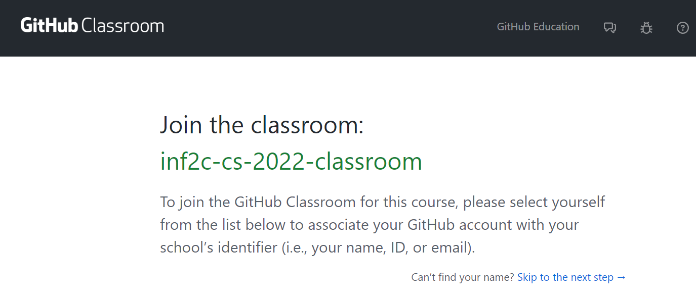

# Informatics 2C Computer Systems - Coursework 2

# DEADLINE Friday 01st December 2023 at 16:00 BST

Coursework 2 uses GitHub Classroom as a platform to host our coursework. The
detailed instructions for this coursework will be given directly on GitHub. In
this document we will explain the steps to access GitHub Classroom.

## 1) Open GitHub Classroom

Open the GitHub Classroom lab URL:
[https://classroom.github.com/a/FC8jwUdb](https://classroom.github.com/a/FC8jwUdb).

## 2) Select Your Student ID

Choose your University student number from the list of identifiers.  This is an
important step which would enable us to autograde your submissions and give
correct marks by linking your GitHub username and your student number. If there
has been a mistake in selecting the identifiers, let us know ASAP.

This step can be skipped if you already registered for Lab 3 on GitHub.

## 3) Inspect the Coursework Repository

Once you have selected your identifier from the list, GitHub classrooms will
create a new repository for you.

You can now navigate to your repository which lists the files needed in this coursework
and shows a README.md file that provides detailed instructions for this coursework.
